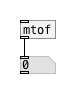
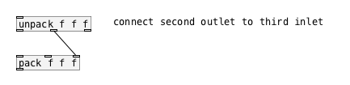
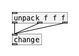
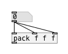
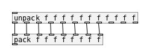
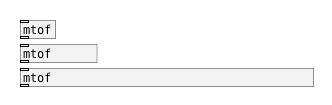
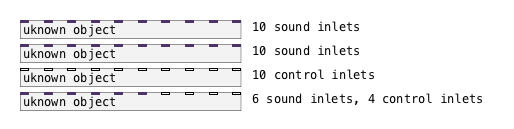
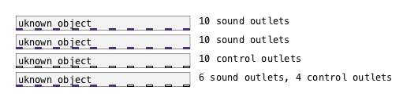
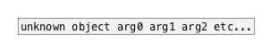

# PDDOC
PureData documentation generator

 
This is a generator that creates *-help.pd files from single **pddoc**-formatted files and another .pd file from XML that contains objects, short descriptions and links to help files.

---

Requires: pycairo
  

  
_    | _   
--- | --- 
 **pd_doc2pd** | Converts pddoc file to PureData help patch 
 **pd_doc2html** | Converts pddoc file to HTML file
 **pd_doc2md** | Converts pddoc file to PureData help patch 
 **pd_makelibrary** | Creates XML file for set of pddoc files 
 **pd_lib2pd** | Converts XML file to PureData patch with objects links to help files 
 **pd_cat2pd** | Converts XML file with category info to separate patch with object links 


---
## 1. XML file

```xml
<library xmlns:xi="http://www.w3.org/2001/XInclude" name="--your-library-name--" version="1.0">
  <category name="--category--">
    <entry descr="Object description" name="the_object" ref_view="object">
      <xi:include href="the_object.pddoc" parse="xml"/>
    </entry>
  </category>
 <meta>
    <version> % </version>
    <authors>
      <author> % </author>
    </authors>
  </meta>
 </library>
```
### library
- **name** (required)

### category
- **name** (required)

### entry
- **name** (required)
- **ref_view** (required):
    - object
    - link      (for UI objects)

XML file for category:
```xml
<?xml version="1.0" encoding="UTF-8"?>
<category-info version="1.0">
description
</category-info>
```

---
## 2. pddoc file

```xml
<?xml version="1.0" encoding="utf-8"?>
<pddoc version="1.0">
    <object name="the_object">
        <title>the_object</title>
        <meta>
            <authors>
                <author> % </author>
            </authors>
            <description>% </description>
            <license> % </license>
            <library> % </library>
            <category> % </category>
            <keywords> % </keywords>
            <since> % </since>
        </meta>
        <info>
            <par> Paragraph text </par>
        </info>
        <arguments>
            <argument name="ARG_NAME" type="symbol">argument name</argument>
        </arguments>
        <properties>
            <property name="@property_name" type="symbol">property name</property>
        </properties>
        <inlets>
            <inlet>
                <xinfo on="bang">detailed description</xinfo>
            </inlet>
        </inlets>
        <outlets>
            <outlet>description</outlet>
        </outlets>
        <mouse>
            <event type="left-click" edit_mode="0" keys="Shift+Ctrl">Some info</event>
        </mouse>
        <example>
            <pdascii>
<![CDATA[

[message_box(                                 
|
[object_box]

]]>
            </pdascii>
        </example>
    </object>
</pddoc>
```
### header:
- `<pddoc>`
    - **version** (required)
- `<object>`
    - **name** (required)
- `<title>`
- `<meta>`
    - `<authors>`
    - `<description>`
    - `<license>`
    - `<library>`
    - `<category>`
    - `<keywords>`
    - `<since>`
   
### info
```xml
<info>
    <par> Paragraph text </par>
    <wiki name="Arithmetic_mean">Arithmetic mean</wiki>
</info>
```
### arguments
- **name** (required)
- **type** (required):
    - int
    - float
    - symbol
    - atom - int, float or symbol
    - list - list of atoms
    
### properties

```xml
<properties>
    <property name="PROP" type="TYPE">description</property>
</properties>
```

- **name** (required)
- **type** (required):
    - int
    - float
    - symbol
    - atom - int, float or symbol
    - list - list of atoms
    - alias - alias for other property
    - flag - property that is **True** when specified, otherwise **False**
- **readonly**
- **units** - value unit from list:
    - herz
    - kiloherz
    - decibell (db)
    - millisecond (msec)
    - second (sec)
    - bpm
    - percent
    - sample
    - semitone
    - cent
    - radian
    - degree
- **minvalue** - minimum allowed value
- **maxvalue** - maximum allowed value
- **default** - default value, if not specified
- **category** - value from this list (in sort order):
    - main
    - midi
    - preset
    - color
    - label
    - font
    - basic
- **enum** - space separated list of allowed values
    ```xml 
    <property enum="A B C"/>
    ```
    
### methods
```xml
<methods>
    <method name="NAME">
        description
        <param type="TYPE" name="XXX" required="true"></param>
        ...
    </method>
    ...
</methods>
```
- **method name** method name
- **type** value type
- **required** true if the parameter is required

### inlets
```xml
<inlets dynamic="true">
    <inlet type="TYPE" number="XXX">
        <xinfo on="symbol"></xinfo>
    </inlet>
</inlets>
```

- **dynamic** *(optional)* - if True, external has dynamic number of inlets, otherwise fixed.
- **type** *(optional)* - inlet type:
    - control
    - audio
- **number** *(optional)* - manually specified inlet number: number, or "n", or "n+1", or "n-1", or "..."
- **on** *(optional)* - describe reaction on input data type. Data types:
    - atom
    - int
    - float
    - list
    - symbol
    - pointer
    - any
    - data - for additional data types
    - data:set
    - data:dict
    - data:mlist
    - data:string
    - data:fifo
    
### outlets
```xml
<outlets>
    <outlet>
        description
    </outlet>
</outlets>
```

### mouse
```xml
<mouse>
    <event type="drag" keys="Shift" editmode="false"></event>
</mouse>
```

- **type** - event type from list:
    - left-click
    - right-click
    - middle-click
    - double-click
    - drag
- **keys** - key modifiers, like Shift+Alt
- **editmode** - edit mode on/off

### example
```
<example>
    <pdascii>
<![CDATA[

[message_box(                                 
|
[object_box]

]]>
    </pdascii>
</example>
```

- [*value*( - message box
- [*value* *key*=*value* *{key=param}*] - object box with optional key-value support
- [T], [_] - toggle
- [B], [O] - bang
- [F] - number box
- [A] - array
- [HR] - horizontal radio
- [VR] - vertical radio
- [HS] - horizontal slider
- [VS] - vertical slider
- [S digits=10] - symbol entry with width 10 chars
- [obj1] X [obj2] - cross connection
- [obj1 #a] - object with id:a
- [X a->b] - connect object #a to object with id:b
- [X a:1->b:0] - connect second outlet of object #a to first inlet of object #b

#### connections
- | - simple connection
```
[mtof]
|
|
[F]
```


- ^|. - specified connection. Number of **"^"** specifies outlet index.
Number of **"."** specifies inlet index
```
[unpack f f f] /*connect second outlet to third inlet*/
^|
 |
 |..
[pack f f f]
```


- \*| - all to one connection. Note: no simple cord continuation.
```
[unpack f f f] 
*|
*|
[flow.count]
```


- |\* - one to all connection. Note: no simple cord continuation.
```
[F]
|*
|*
[pack f f f]
```   


- \*|\* - parallel connection. Note: no simple cord continuation.
```
[unpack f f f f f f f f f f f] 
*|*
*|*
[pack f f f f f f f f]
```   


#### options

##### object width in chars

```
[mtof]

[mtof {w=10}]

[mtof {w=40}]
```



##### object inlets

```
[uknown object {i=10,w=30}]  /*10 sound inlets*/

[uknown object {i=10~,w=30}] /*10 sound inlets*/

[uknown object {i=~10,w=30}] /*10 control inlets*/

[uknown object {i=6~4,w=30}] /*6 sound inlets, 4 control inlets*/
```


##### object outlets

```
[uknown object {o=10,w=30}]  /*10 sound outlets*/

[uknown object {o=10~,w=30}] /*10 sound outlets*/

[uknown object {o=~10,w=30}] /*10 control outlets*/

[uknown object {o=6~4,w=30}] /*6 sound outlets, 4 control outlets*/
```


##### object aliases

```
[unknown object #a]
#a arg0 arg1 arg2 etc...
```


