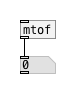
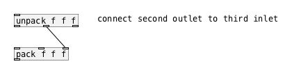
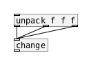
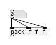
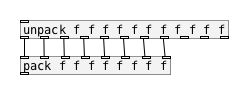
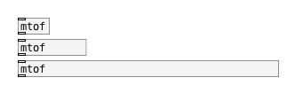
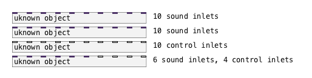
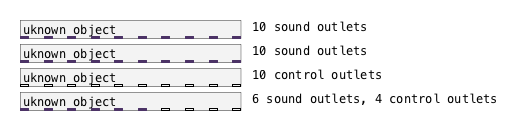
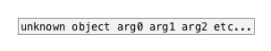

# PDDOC

PureData documentation generator

This is a generator that creates *-help.pd files from single **pddoc**-formatted files and another .pd file from
XML that contains objects, short descriptions and links to help files.

---

Requires: pycairo

| _                  | _                                                                        |
|--------------------|--------------------------------------------------------------------------|
| **pd_doc2pd**      | Converts pddoc file to PureData help patch                               |
| **pd_doc2html**    | Converts pddoc file to HTML file                                         |
| **pd_doc2md**      | Converts pddoc file to PureData help patch                               |
| **pd_makelibrary** | Creates XML file for set of pddoc files                                  |
| **pd_lib2pd**      | Converts XML file to PureData patch with objects links to help files     |
| **pd_cat2pd**      | Converts XML file with category info to separate patch with object links |

---

## 1. XML file

```xml

<library xmlns:xi="http://www.w3.org/2001/XInclude" name="--your-library-name--" version="1.0">
    <category name="--category--">
        <entry descr="Object description" name="the_object" ref_view="object">
            <xi:include href="the_object.pddoc" parse="xml"/>
        </entry>
    </category>
    <meta>
        <version>%</version>
        <authors>
            <author>%</author>
        </authors>
    </meta>
</library>
```

### library

- **name** (required)

### category

- **name** (required)

### entry

- **name** (required)
- **ref_view** (required):
    - object
    - link      (for UI objects)

XML file for category:

```xml
<?xml version="1.0" encoding="UTF-8"?>
<category-info version="1.0">
    description
</category-info>
```

---

## 2. pddoc file

```xml
<?xml version="1.0" encoding="utf-8"?>
<pddoc version="1.0">
    <object name="the_object">
        <title>the_object</title>
        <meta>
            <authors>
                <author>%</author>
            </authors>
            <description>
              <tr lang="en">%</tr>
            </description>
            <license>%</license>
            <library>%</library>
            <category>%</category>
            <keywords>%</keywords>
            <since>%</since>
            <aliases>
              <alias>%</alias>
            </aliases>
        </meta>
        <info>
          <par indent="1"><tr lang="ru">Paragraph text</tr></par>
          <a href="url://">Title</a>
          <wiki name="WIKI_NAME">Title</wiki>
          <itemize>
            <item><a href="">Item</a></item>
          </itemize>
        </info>
        <arguments>
            <argument name="ARG_NAME" type="symbol" units="millisecond" minvalue="0" maxvalue="2" enum="0 1 2">
              <tr lang="en">argument name</tr>
            </argument>
        </arguments>
        <properties>
            <property name="@property_name" type="symbol" units="millisecond" minvalue="0" maxvalue="2" enum="0 1 2">
              <tr lang="ru">property name</tr>
            </property>
        </properties>
        <inlets>
            <inlet>
              <in on="bang"><tr lang="en">detailed description</tr></in>
            </inlet>
        </inlets>
        <outlets>
          <outlet>
            <out type="int"><tr lang="">description</tr></out>
          </outlet>
        </outlets>
        <mouse>
            <event type="left-click" edit_mode="0" keys="Shift+Ctrl">Some info</event>
        </mouse>
        <example>
            <pdascii>
                <![CDATA[

[message_box(                                 
|
[object_box]

]]>
            </pdascii>
        </example>
    </object>
</pddoc>
```

### header:

- `<pddoc>`
    - **version** (required)
- `<object>`
    - **name** (required)
- `<title>`
- `<meta>`
    - `<authors>`
    - `<description>`
    - `<license>`
    - `<library>`
    - `<category>`
    - `<contacts>`
    - `<keywords>`
    - `<since>`
    - `<version>`
    - `<website>`
    - `<aliases>`
    - `<also>`

### info

```xml

<info>
    <par>
      <tr lang="en">Paragraph text</tr>
      <tr lang="ru">Текст параграфа</tr>
    </par>
    <wiki name="Arithmetic_mean">Arithmetic mean</wiki>
    <a href="https://puredata.info">Pure Data home</a>
</info>
```

### arguments

- **name** (required)
- **type** (required):
    - int
    - float
    - symbol
    - atom - int, float or symbol
    - list - list of atoms
- **minvalue**
- **maxvalue**
- **units**
- **enum**

### properties

```xml

<properties>
  <property name="PROP" type="TYPE"><tr lang="en">description</tr></property>
</properties>
```

- **name** (required)
- **type** (required):
    - int
    - float
    - symbol
    - atom - int, float or symbol
    - list - list of atoms
    - alias - alias for other property
    - flag - property that is **True** when specified, otherwise **False**
- **access** - value from list:
    - readwrite
    - readonly
    - initonly
- **units** - value unit from list:
    - hertz
    - kilohertz
    - decibel (db)
    - millisecond (msec)
    - second (sec)
    - bpm
    - percent
    - sample
    - semitone
    - cent
    - radian
    - degree
- **minvalue** - minimum allowed value
- **maxvalue** - maximum allowed value
- **default** - default value, if not specified
- **category** - value from this list (in sort order):
    - main
    - midi
    - preset
    - color
    - label
    - font
    - basic
- **enum** - space separated list of allowed values
    ```xml 
    <property enum="A B C"/>
    ```

### methods

```xml

<methods>
    <method name="NAME">
      <info><tr lang="en">description</tr></info>
      <param type="TYPE" name="XXX" required="true"><tr lang="">description</tr></param>
        ...
    </method>
    ...
</methods>
```

- **method name** method name
- **type** value type
- **required** true if the parameter is required

### inlets

```xml

<inlets dynamic="true">
    <inlet type="TYPE" number="XXX">
      <in on="symbol"><tr lang="en">description</tr></in>
    </inlet>
</inlets>
```

- **dynamic** *(optional)* - if True, external has dynamic number of inlets, otherwise fixed.
- **type** *(optional)* - inlet type:
    - control
    - audio
- **number** *(optional)* - manually specified inlet number: number, or "n", or "n+1", or "n-1", or "..."
- **on** *(optional)* - describe reaction on input data type. Data types:
    - atom
    - int
    - float
    - list
    - symbol
    - pointer
    - any
    - data - for additional data types
    - data:set
    - data:dict
    - data:mlist
    - data:string
    - data:fifo

### outlets

```xml

<outlets dynamic="false">
    <outlet type="audio">
        <out type="int"><tr lang="en">description</tr></out>
    </outlet>
</outlets>
```

### mouse

```xml

<mouse>
    <event type="drag" keys="Shift" editmode="false">description</event>
</mouse>
```

- **type** - event type from list:
    - left-click
    - right-click
    - middle-click
    - double-click
    - drag
- **keys** - key modifiers, like Shift+Alt
- **editmode** - edit mode on/off

### example

```
<example>
    <pdascii>
<![CDATA[

[message_box(                                 
|
[object_box]

]]>
    </pdascii>
</example>
```

- [*value*( - message box
- [*value* *key*=*value* *{key=param}*] - object box with optional key-value support
- [T], [_] - toggle
- [B], [O] - bang
- [F] - number box
- [A] - array
- [HR] - horizontal radio
- [VR] - vertical radio
- [HS] - horizontal slider
- [VS] - vertical slider
- [S digits=10] - symbol entry with width 10 chars
- [L digits=20] - list entry with width 20 chars
- [obj1] X [obj2] - cross connection
- [obj1 #a] - object with id:a
- [X a->b] - connect object #a to object with id:b
- [X a:1->b:0] - connect second outlet of object #a to first inlet of object #b

#### connections

- | - simple connection

```
[mtof]
|
|
[F]
```



- ^|. - specified connection. Number of **"^"** specifies outlet index.
  Number of **"."** specifies inlet index

```
[unpack f f f] /*connect second outlet to third inlet*/
^|
 |
 |..
[pack f f f]
```



- \*| - all to one connection. Note: no simple cord continuation.

```
[unpack f f f] 
*|
*|
[flow.count]
```



- |\* - one to all connection. Note: no simple cord continuation.

```
[F]
|*
|*
[pack f f f]
```   



- \*|\* - parallel connection. Note: no simple cord continuation.

```
[unpack f f f f f f f f f f f] 
*|*
*|*
[pack f f f f f f f f]
```   



#### options

##### object x-position in pddoc spaces

```
[mtof {x=10}]

[mtof {x=40}]
```

##### object width in chars

```
[mtof]

[mtof {w=10}]

[mtof {w=40}]
```



##### object inlets

```
[uknown object {i=10,w=30}]  /*10 sound inlets*/

[uknown object {i=10~,w=30}] /*10 sound inlets*/

[uknown object {i=~10,w=30}] /*10 control inlets*/

[uknown object {i=6~4,w=30}] /*6 sound inlets, 4 control inlets*/
```



##### object outlets

```
[uknown object {o=10,w=30}]  /*10 sound outlets*/

[uknown object {o=10~,w=30}] /*10 sound outlets*/

[uknown object {o=~10,w=30}] /*10 control outlets*/

[uknown object {o=6~4,w=30}] /*6 sound outlets, 4 control outlets*/
```



##### array params

```
[array size=400 save=1]        /*400 elements, save-in-patch flag: 1*/

[array w=400 h=200]            /*width: 400, height: 200*/

[array yr=-20..300]            /*y-value range: from -20 to 300*/

[array style=line|point|curve] /*array draw style*/
```

##### object aliases

```
[unknown object #a]
#a arg0 arg1 arg2 etc...
```



